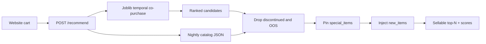

# Phase 6 — Separating modeling logic from business rules

**Business question:** Why is the model recommending items we can’t sell?

A co-purchase model does not know inventory, product life cycle, or this week’s
campaign. If we bake “don’t recommend SKU 4” into the weights, we have to
retrain every time stock changes. Rules that change nightly belong **next to**
the model, not **inside** it.

## Architecture

Code:

| Piece | File |
|---|---|
| Model scores only | `artifacts/recommender.joblib` via `models/phase3a_temporal_recommender.py` |
| Business rules | `api/engine.py` (`RecommenderEngine.recommend`) |
| Nightly lists | `catalog/discontinued.json`, `out_of_stock.json`, `special_items.json`, `new_items.json` |
| HTTP contract | `api/main.py` |

The API loads the joblib **once** at startup. It reloads JSON on
`POST /v1/admin/reload-rules` so a stock-out does not require a new image.

## What belongs where

| Belongs in the **model** | Belongs in the **serving layer** |
|---|---|
| Historical co-purchase / recency | Can we sell it *today*? |
| “Customers who bought 240 also bought 331” | Discontinued SKUs |
| Popularity fallback when the cart is unknown | Out-of-stock SKUs |
| Ranking among items the model has seen | Holiday / promo pins |
| | Cold-start exploration of never-sold items |

The model answers affinity. The serving layer answers merchandising and
operations. Mixing them makes retraining the only way to hide a dead PDP.

## Implementation (already in the API)

For a request `{ "cart": [...], "top_n": 10 }`:

1. Score a **pool of 50** candidates from the temporal model (not just 10), so
   drops still leave a full list.
2. **Remove** anything in `discontinued.json` or `out_of_stock.json`, and
   anything already in the cart.
3. **Pin** up to three `special_items.json` campaigns at the front (new
   arrivals / holiday), only if sellable.
4. **Inject** one in-stock SKU from `new_items.json` (randomized exploration).
5. Fill remaining slots from the filtered model ranking.
6. Return `recommendations` and `scores` with the same length, ≤ `top_n`.

That is the Phase 5 cold-start policy sitting in the same layer as inventory
rules, which is the point of Phase 6.

## Example: rules override the model

Cart used by the grader: `["240", "200", "277", "78"]`, `top_n = 10`.

**Model only** (no JSON rules) — top 15:

| Rank | SKU | Score | After rules |
|---:|---:|---:|---|
| 1 | 331 | 0.103 | kept (model) |
| 2 | 172 | 0.087 | kept |
| 3 | 111 | 0.084 | kept |
| 4 | 295 | 0.082 | kept |
| 5 | 173 | 0.071 | kept |
| 6 | 75 | 0.065 | kept |
| 13 | **275** | 0.043 | **dropped — out of stock** |
| 14 | **4** | 0.041 | **dropped — out of stock** |
| 15 | **329** | 0.040 | **dropped — out of stock** |

Without the serving layer, a customer could be sent to 275, 4, or 329 and hit a
dead product page — the exact failure in the business question.

**After business rules:**

| Slot | SKU | Source | Why it is here |
|---:|---:|---|---|
| 1 | **388** | promotion / new_arrival | merchandising pin; **not** in model top 15 |
| 2 | **382** | promotion / new_arrival | same |
| 3 | **381** | promotion / new_arrival | same |
| 4 | **374** | cold_start_explore | randomized new item with little/no co-purchase |
| 5–10 | 331, 172, 111, 295, 173, 75 | model | filtered co-purchase |

- Overlap with discontinued: **none**
- Overlap with out of stock: **none**
- Overlap with the cart: **none**
- Filters applied: `drop_discontinued`, `drop_out_of_stock`, `promotion_override`, `cold_start_explore`

SKU 388 has almost no historical co-purchase with this cart. The model would
not have shown it. The serving layer **overrides** that because merchandising
marked it as a new arrival. SKU 4 *would* have been shown and is **blocked**
because it is out of stock.

That is the contract: the model proposes, business rules dispose.
