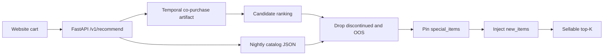

# Phases 4–7: Production recommendation system

This system serves the Phase 3a temporal co-purchase model behind an HTTP API,
then applies inventory and merchandising rules that do **not** belong in the
model weights.

## Phase 4 — API deployment

**Choice: joblib artifact + FastAPI + Docker.** The ranking model is a nested
dictionary of weighted co-purchase scores. Joblib (pickle) round-trips that
structure without a GPU runtime. FastAPI keeps the contract explicit. Docker
pins the serving image so the website does not depend on a laptop venv.

The live model is trained from `data/cart_export_19_05.csv` (the latest extract)
with a 180-day half-life. LSTM weights are **not** served: they were slower to
train, heavier to ship, and weaker than temporal weighting on this catalog.

### Contract

`POST /v1/recommend`

```json
{
  "cart_items": [227, 228],
  "top_k": 10,
  "explore": true,
  "seed": 42
}
```

```json
{
  "recommendations": [
    {"product_id": 388, "score": 1001.0, "source": "promotion", "campaign": "new_arrival"},
    {"product_id": 382, "score": 1001.0, "source": "promotion", "campaign": "new_arrival"},
    {"product_id": 371, "score": 0.0, "source": "cold_start_explore", "campaign": "new_item_exploration"}
  ],
  "latency_ms": 1.2,
  "model_version": "temporal-180d",
  "train_data": "cart_export_19_05.csv",
  "filters_applied": ["cold_start_explore", "drop_discontinued", "drop_out_of_stock", "promotion_override"]
}
```

`GET /health` is the liveness probe. `POST /v1/admin/reload-rules` hot-loads the
nightly JSON files without retraining.

SLO: **p99 recommend < 500 ms**. Scoring is an in-memory dict lookup; measured
latency on this catalog is ~1–5 ms.

### Run locally

```bash
source .venv/bin/activate
python3 models/generate_catalog_lists.py --cart-data data/cart_export_19_05.csv
python3 models/train_serving_model.py --train-data data/cart_export_19_05.csv
uvicorn api.main:app --host 127.0.0.1 --port 8000
```

```bash
curl -s http://127.0.0.1:8000/health
curl -s http://127.0.0.1:8000/v1/recommend \
  -H 'content-type: application/json' \
  -d '{"cart_items":[227,228],"top_k":10,"seed":42}'
```

### Docker

```bash
docker compose up --build
```

The `catalog/` directory is mounted so nightly JSON updates do not require a
rebuild. A new model artifact is copied into `artifacts/` and the container is
restarted (or replaced) after a passing monthly eval.

## Phase 5 — More data and cold start

Retrain command (assignment split):

```bash
python3 models/evaluate_phase5.py \
  --train-data data/cart_export_17_10.csv \
  --test-data data/answer_2017-11.csv
```

| Split | HitRate@10 |
|---|---:|
| `cart_export_17_10` → Nov 2017 (temporal 180d) | **0.5862** (1170/1996) |
| Same, cutoff before Nov 2017 | 0.5822 (1162/1996) |
| Phase 1 2011–2015 → Jan 2016 | 0.3986 |

Including 2016–2017 history lifts HitRate because November carts actually
contain 2017 SKUs. Empirically:

- 31 products first appear in 2017 (IDs 315–342, 344–346). Assignment text
  cited 32 new / 4 discontinued; this extract shows **31 new** and **18 SKUs
  sold in 2016 but not 2017**.
- Cumulative catalog: 253 SKUs through 2015 → 296 through 2016 (**+17.0%**) →
  327 through 2017 (**+10.5%**). Direction matches the 13.7% / 7% note;
  percentages differ because we count distinct `cart_product_id` values in the
  exports rather than a merchandising master list.
- **733 / 1996** November cases have a 2017-new SKU in the *answer*. A model
  trained only through 2016 can never rank those items from co-purchase.

That is popularity + cold-start bias: the scorer only knows items that already
sold together. New arrivals stay invisible until we either retrain or inject
them in the serving layer.

### Retraining schedule

| Cadence | Action | Why |
|---|---|---|
| **Nightly** | Refresh `discontinued.json`, `out_of_stock.json`, `new_items.json`, `special_items.json`. Reload rules. **Do not** pull a new cart-history report. | Inventory changes daily. A cart extract takes ~4 hours and costs $1.21–$4.53. |
| **Monthly** | Request one cart extract (after spend approval), retrain temporal-180d, evaluate on a frozen holdout, promote if HitRate@10 ≥ 0.40 and not >5pp below last month. | Phase 2 showed 11 months of *stable* co-purchase; monthly is enough for relationship drift and cheap enough for catalog growth. |
| **Triggered** | Retrain off-cycle if `new_items.json` grows by ≥15 SKUs in a week, HitRate@10 drops ≥5pp, or discontinued count jumps. | 2017 added ~31 SKUs; waiting a full quarter would leave a large slice of the catalog unscored. |

Human approval is required to buy a cart extract and to promote a candidate
artifact that fails the HitRate floor.

### Cold-start strategy (tied to business goals)

1. **Promotional overrides** (`special_items.json`) pin merchandising picks
   (new arrivals, holiday features) to the top slots. Goal: launch visibility
   and campaign fidelity, not model purity.
2. **Randomized exploration** injects 1 in-stock SKU from `new_items.json`
   into the list. Goal: customer experience still looks like “people also
   bought,” but we collect the first co-purchase edges for items the model
   cannot yet score. This is the serving-layer analogue of balanced injection
   (EquiRate): do not wait for popularity.
3. **Monthly retrain** folds whatever exploration produced into the next
   co-purchase graph. Goal: long-term data collection without a 4-hour extract
   every night.

We do **not** dump random catalog noise into every slot. Exploration is one
slot, only among sellable new items, so relevance stays high.

## Phase 6 — Model vs business rules



| Belongs in the **model** | Belongs in the **serving layer** |
|---|---|
| What historically goes together | Can we sell it *today*? |
| Recency-weighted co-purchase | Discontinued / out of stock |
| Popularity fallback for empty carts | Holiday and promo pins |
| Next-item affinity | Cold-start exploration |

Example: the model may rank product 52 highly because it co-occurred for years.
If `discontinued.json` or `out_of_stock.json` contains 52, the API never
returns it. A pinned `special_items` campaign can still surface SKU 382 even
if its co-purchase score is near zero. That is the override: **business rules
win after scoring**, so customers do not click a recommendation into a dead PDP.

## Phase 7 — Automation

Use `cart_export_19_05.csv` plus the four nightly JSON files in `catalog/`.

```bash
python3 scripts/nightly_refresh.py --cart-data data/cart_export_19_05.csv --skip-reload
python3 scripts/monthly_retrain.py --train-data data/cart_export_19_05.csv
```

| When | What | Human? |
|---|---|---|
| Nightly | Regenerate catalog JSON from the latest *local* extract; `POST /v1/admin/reload-rules`. | No |
| Weekly | Eye-check `artifacts/last_retrain_report.json` and JSON file sizes; page if OOS list is empty or huge. | Light |
| Monthly | Approve $1.21–$4.53 extract; `monthly_retrain.py`; restart API if promoted. | Yes for extract + failed gates |
| Off-cycle | Trigger retrain on catalog-churn or HitRate alerts. | Yes if spend is required |

### Risks to monitor

- **Stale inventory JSON** → recommending OOS items again. Alert if
  `generated_at` is >26 hours old.
- **Empty `new_items.json`** after a known launch → exploration silently off.
- **Failed joblib load** after promote → health check fails; keep previous
  artifact on disk (`recommender.joblib.bak` recommended in ops).
- **Holdout mismatch** → November 2017 is not a 2019 cart. Treat HitRate as a
  smoke test, not a 2019 A/B. Replace holdout when a newer answer file exists.
- **Extract cost blow-up** if nightly jobs start requesting cart history.
  Nightly jobs must never call the warehouse report.
- **Exploration starvation** of long-tail items if merchandising pins consume
  all 10 slots. Cap pins at 3 in `generate_catalog_lists.py`.
